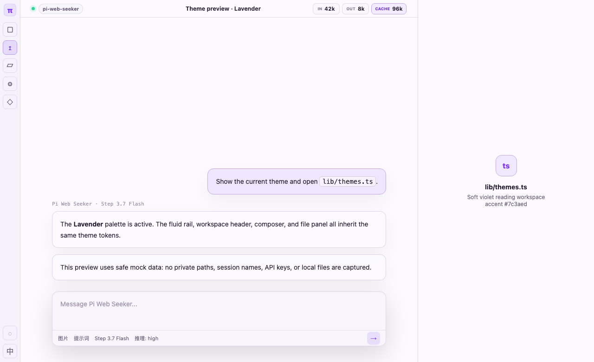
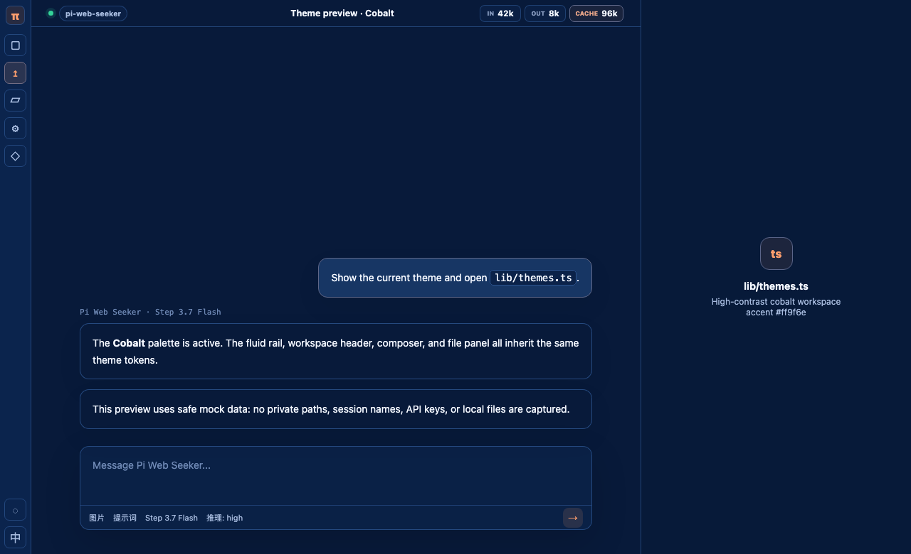
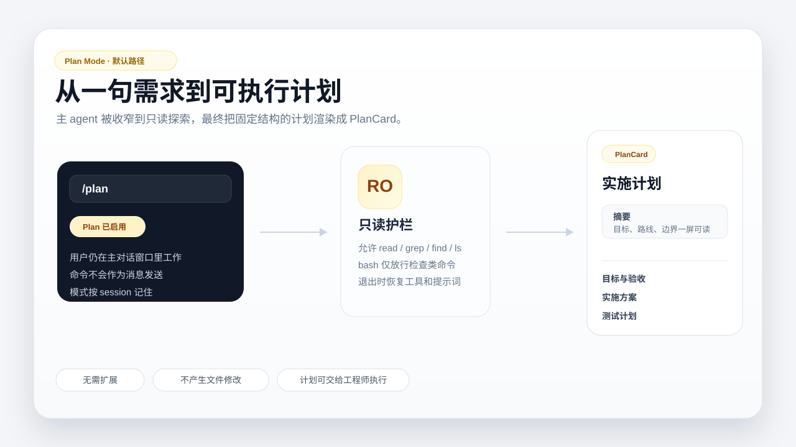
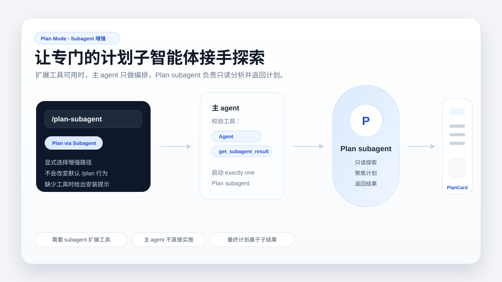
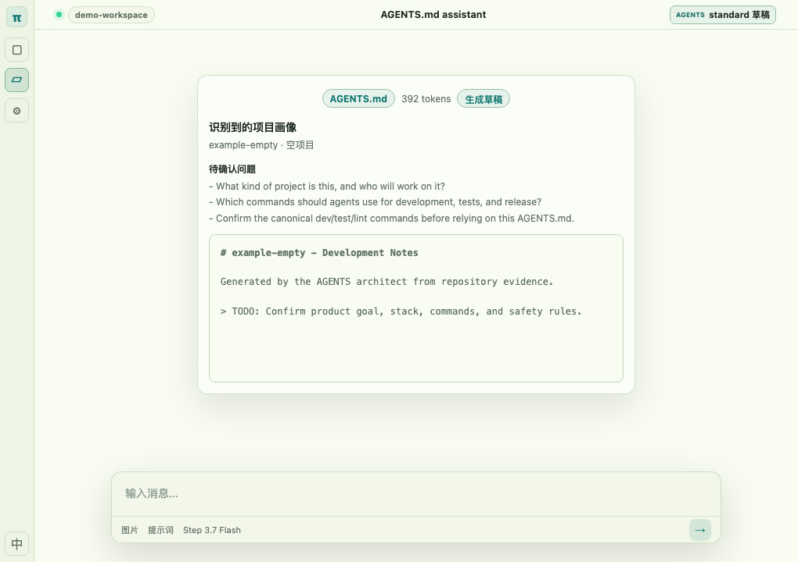
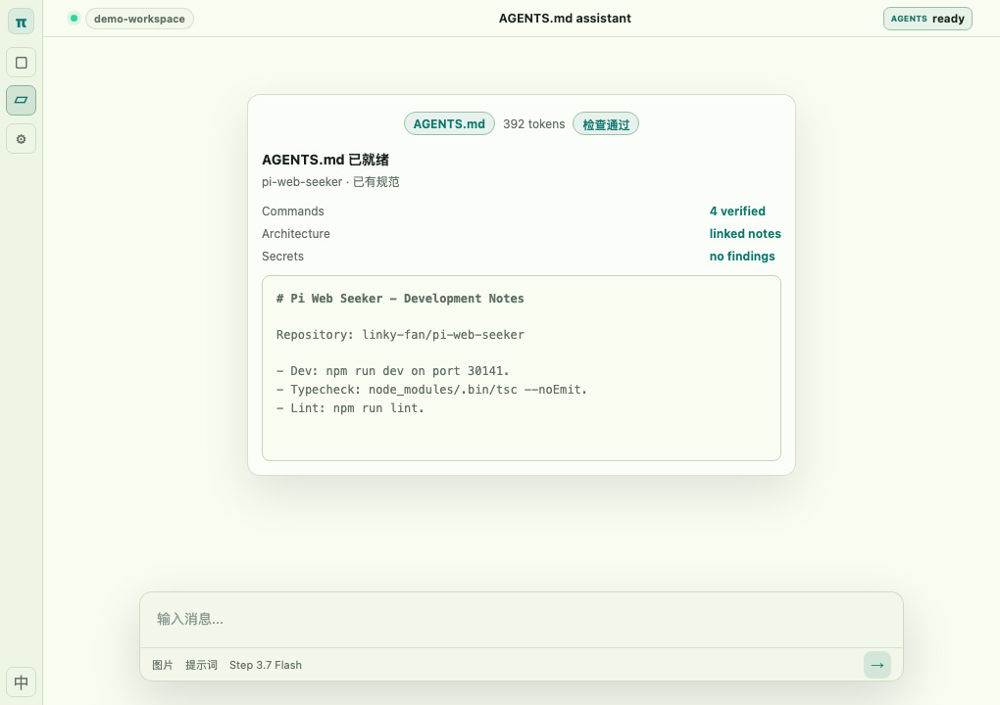
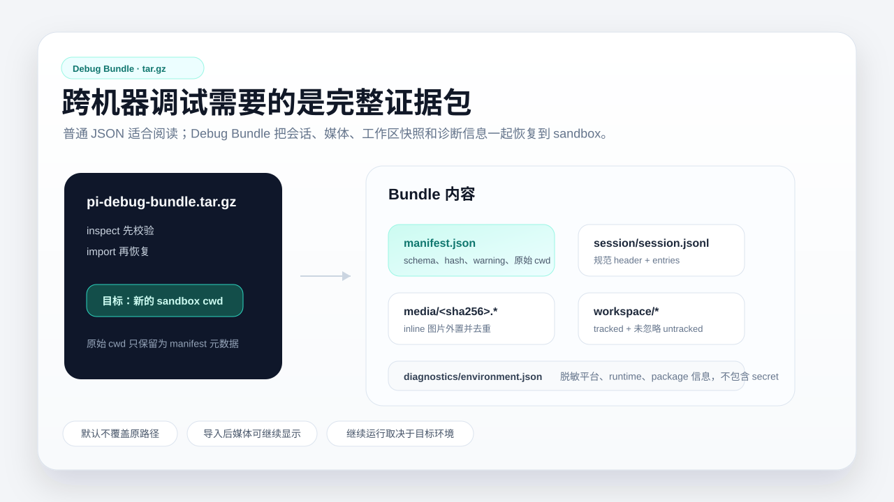
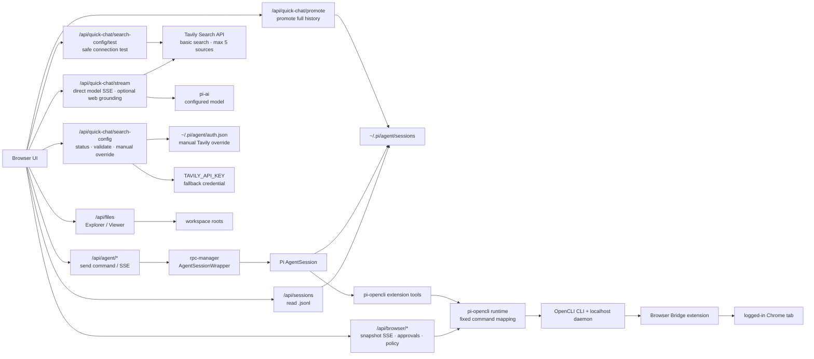

# Pi Web Seeker

[pi 编程智能体](https://github.com/earendil-works/pi) 的网页界面。它让你在浏览器里浏览 pi 会话、继续对话、分叉历史、管理模型、查看文件和导出调试包。

仓库：[linky-fan/pi-web-seeker](https://github.com/linky-fan/pi-web-seeker)

## 快速开始

无需安装，直接运行已发布版本：

```bash
npx @linkyfan/pi-web
```

全局安装：

```bash
npm install -g @linkyfan/pi-web
pi-web
```

默认监听 `0.0.0.0:30141`，本机打开 [http://localhost:30141](http://localhost:30141)。局域网访问可用 `http://<你的局域网 IP>:30141`。

常用参数：

```bash
pi-web --port 8080
pi-web --hostname 127.0.0.1
PORT=8080 PI_WEB_BIND_HOST=127.0.0.1 pi-web
```

不可信网络建议开启访问令牌：

```bash
PI_WEB_ACCESS_TOKEN=your-long-random-token pi-web
```

首次访问 `http://<host>:30141/?token=your-long-random-token` 后，服务端会写入 HttpOnly cookie；脚本调用 API 也可以使用 `Authorization: Bearer <token>` 或 `x-pi-web-token: <token>`。

## 便携版

不想安装 Node.js / npm 时，可以在 GitHub Release 下载便携包：

- Windows x64：`pi-web-seeker-vX.Y.Z-windows-x64.zip`
- macOS Apple Silicon：`pi-web-seeker-vX.Y.Z-macos-arm64.zip`
- macOS Intel：`pi-web-seeker-vX.Y.Z-macos-x64.zip`

解压后运行 `start-pi-web.cmd`、`start-pi-web.ps1` 或 `start-pi-web.command`。便携包内置 Node.js 和生产依赖，不包含用户数据、API key、会话、`.env*` 或本地工作区文件。

## 功能概览

| 场景 | 能力 |
| --- | --- |
| 会话 | 浏览 `.jsonl` 历史、SSE 流式对话、刷新后重连、会话分叉、会话内分支 |
| 输入 | 图片上传 / 粘贴、提示词片段、输入历史、草稿保留、完成后追加 |
| 模型 | Provider / model / API key 管理、模型连通性测试、thinking level、工具预设 |
| 上下文 | token / cache / cost / context 统计、压缩提示、system prompt 查看 |
| 文件 | 工作区选择、文件搜索、代码 / Markdown / HTML / 图片 / 音频预览 |
| 扩展 | Skills、Subagent 通知、Plan Mode、AGENTS.md 草稿助手、coms-net / Pi Pi |
| 导入导出 | Markdown / JSON 导出、普通 JSON 导入、Debug Bundle inspect / import |

## 界面预览

| Lavender | Cobalt |
| --- | --- |
|  |  |

| Rose | Gruvbox |
| --- | --- |
|  |  |

### Plan Mode

`/plan` 会让主 agent 进入只读计划模式，适合探索代码和输出实施方案；`/plan-subagent` 是可选增强路径，需要已加载 subagent 工具。





### AGENTS.md 助手

新建或切换工作区时，Pi Web Seeker 会检查项目是否已有 `AGENTS.md`。缺失时可以基于仓库中可证实的信息生成草稿预览；已有时可以运行检查或生成对照草稿。

| 生成草稿 | 已有文件 |
| --- | --- |
|  |  |

### Debug Bundle

Debug Bundle 用于跨机器复现调试，会导出 `.tar.gz`，包含会话、媒体证据、工作区快照和脱敏环境诊断信息。



## Docker

本机个人使用：

```bash
docker compose up --build
```

启动后打开 [http://localhost:30141](http://localhost:30141)。

默认挂载：

- `.pi-web-data` -> `/home/piweb/.pi`，保存会话、模型、登录凭据、settings、skills、prompts、themes
- `.pi-web-workspace` -> `/workspace`，作为容器内默认工作目录
- `~/.ssh` -> `/home/piweb/.ssh:ro`，方便读取私有仓库

常用环境变量：

```bash
PI_WEB_ACCESS_TOKEN=your-long-random-token docker compose up --build
PI_WEB_WORKSPACE=/path/to/project docker compose up --build
PI_WEB_DATA_DIR=/opt/pi-web-seeker/data docker compose up --build
PI_WEB_UID=$(id -u) PI_WEB_GID=$(id -g) docker compose up --build
```

## 开发

```bash
git clone git@github.com:linky-fan/pi-web-seeker.git
cd pi-web-seeker
npm install
npm run dev
```

常用检查：

```bash
node_modules/.bin/tsc --noEmit
npm run lint
node scripts/agents-md.mjs check --path AGENTS.md
```

正式构建：

```bash
npm run build
npm run build -- --turbo
npm run build -- --webpack
```

构建脚本会按平台选择默认构建器：Windows 默认 Turbopack，macOS / Linux 默认 webpack。也可以设置 `PI_WEB_BUILD_ENGINE=turbo` 或 `PI_WEB_BUILD_ENGINE=webpack`。

## 工作方式

Pi Web Seeker 本身是浏览器 UI；浏览历史时直接读取 pi 的 session 文件，真正发送消息时才创建 in-process `AgentSession`。



普通聊天通过 in-process `AgentSession` 使用完整工具能力；即时对话通过 `pi-ai` 直接流式调用已配置模型，不创建 `AgentSession` 或加载 tools。用户可以按需开启 Tavily 预检索，服务端最多提取 5 个来源作为不可信参考上下文，再交给轻量模型作答；关闭联网时不会发起搜索或增加 system prompt。即时历史、联网开关和来源只保留在当前浏览器标签中。Tavily Key 只保存在服务端：`AuthStorage` 中的手动配置优先，`TAVILY_API_KEY` 作为兜底；环境 Key 因 Win11 旧进程或容器配置失效时，可在 Quick Chat 中验证并保存手动覆盖，无需重启服务。用户选择“转正式”后，回答和来源才由 `/api/quick-chat/promote` 写入标准 JSONL 会话。

受控浏览器是可选能力。用户先在本机安装 OpenCLI 和 Browser Bridge，再从右侧 Browser 标签为当前工作区启用内置 `pi-opencli` package。Agent 通过受约束的 extension tools 操作真实 Chrome；Pi Web 只展示临时页面快照、操作轨迹和敏感操作审批，不嵌入第三方页面，也不会保存 Chrome 登录信息。全自动权限只在当前浏览器会话中有效，可信网站按精确 origin 保存到 `~/.pi/agent/browser-policy.json`。

Windows 通过 npm 全局安装 OpenCLI 时，Pi Web 会识别 `opencli.cmd`，读取相邻 `@jackwener/opencli` 包的 `bin.opencli` 入口，并用当前 Node.js 直接启动该入口，全程不经过 shell。解析优先级为 `PI_WEB_OPENCLI_BIN`、当前进程 `PATH`、`%APPDATA%\npm`/`NPM_CONFIG_PREFIX`；手动覆盖可以指向原生可执行文件、OpenCLI JavaScript 入口或 npm shim。安装或修复后可在 Browser 面板点击“重新运行诊断”，无需重启 Pi Web。

首版受控浏览器只支持 Pi Web 服务与 Chrome 位于同一台机器。Docker/远程部署不会自动连接宿主机的 OpenCLI daemon，且现有 Dockerfile、Compose、端口和数据卷不因此改变。

会话文件默认读取 `~/.pi/agent/sessions`，模型配置读取智能体数据目录下的 `models.json`。可通过 `PI_CODING_AGENT_DIR` 指定其他 pi 数据目录。

## 更多文档

- [架构与请求流](docs/agent-notes/architecture.md)
- [Session 文件格式](docs/agent-notes/session-format.md)
- [AGENTS.md 开发说明](AGENTS.md)

## 注意事项

- API key、auth 文件、本地 session 数据、`.env*` 和私有路径不要提交到仓库或截图中。
- 文件 API 会校验 allowed roots，避免通过符号链接读取工作区外文件。
- Docker Compose 默认只暴露 `/workspace` 单工作区；宿主机路径和容器路径不同，旧会话可能仍显示原宿主机路径。
- Debug Bundle 会跳过 `.git`、`node_modules`、`.next`、build/cache、`.env*`、疑似 auth/token/key 文件、超限大文件和 symlink。
