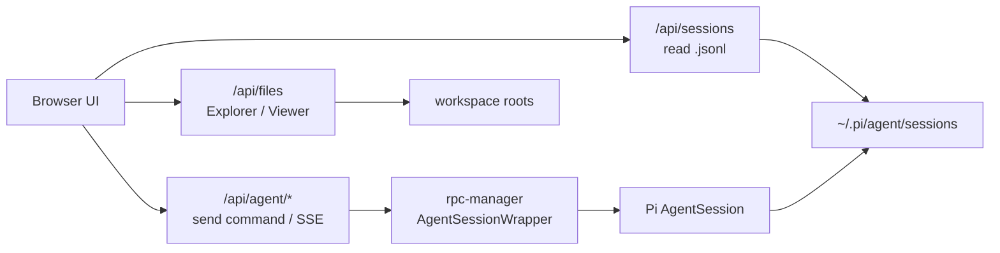
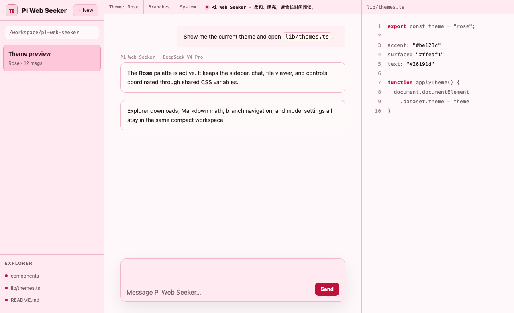
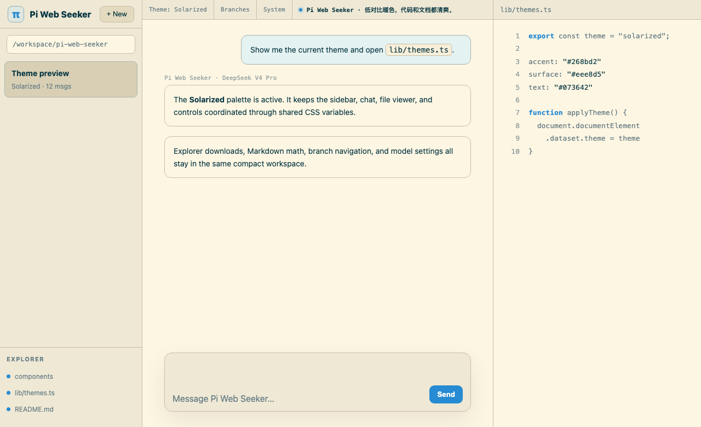
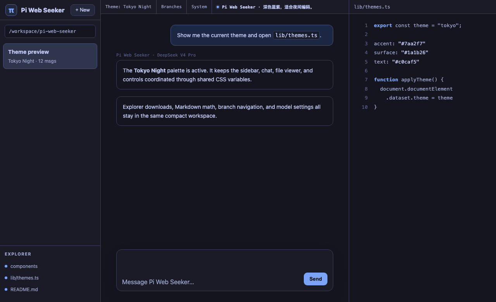
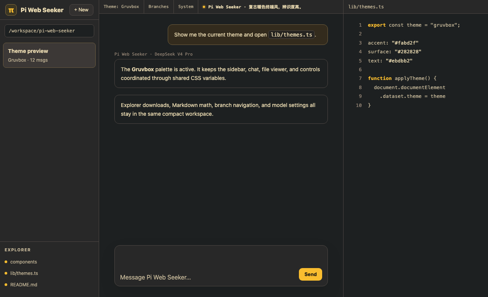
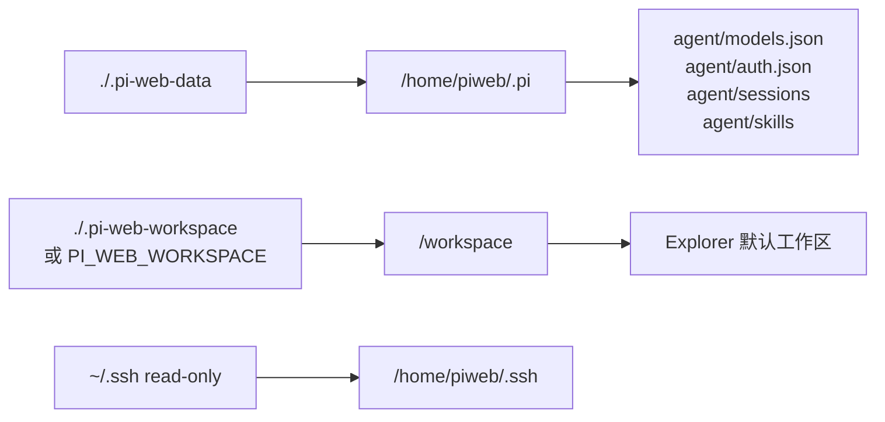
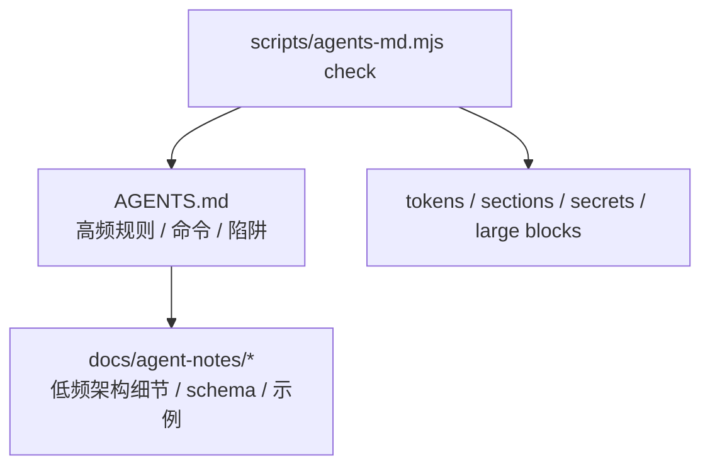
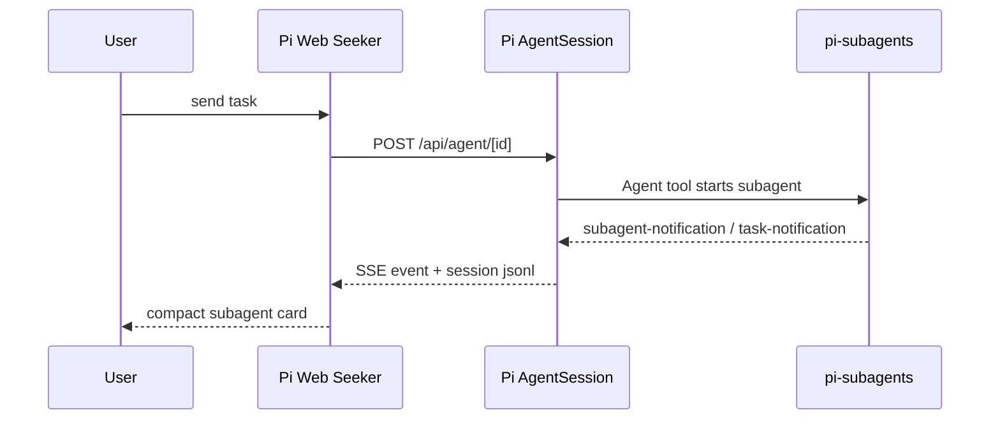
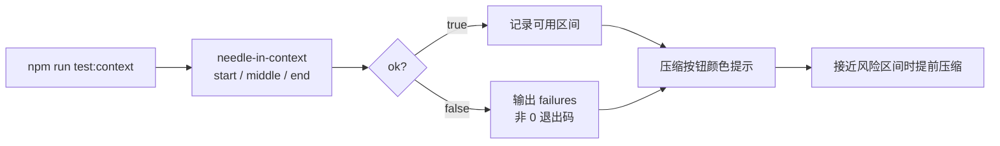

# Pi Web Seeker

[pi 编程智能体](https://github.com/earendil-works/pi) 的网页界面。在浏览器中浏览会话、与智能体对话、分叉对话、切换消息分支。

仓库地址：[linky-fan/pi-web-seeker](https://github.com/linky-fan/pi-web-seeker)

## 工作方式

Pi Web Seeker 本身是浏览器 UI；会话浏览直接读取 pi 的 session 文件，真正发送消息时才创建 in-process `AgentSession`。



## 界面预览

Pi Web Seeker 内置多套 theme，可在左下角或顶部工具栏快速切换。下面是几套代表性配色：

| Rose | Solarized |
| --- | --- |
|  |  |
| 柔和明亮，适合长时间阅读。 | 低对比暖色，代码和文档都清爽。 |

| Tokyo Night | Gruvbox |
| --- | --- |
|  |  |
| 深色蓝紫，适合夜间编码。 | 复古暖色终端风，辨识度高。 |

## 快速开始

**无需安装，直接从当前仓库运行：**

```bash
npx github:linky-fan/pi-web-seeker
```

首次从 GitHub 运行时，npm 会自动构建一次 Next.js 生产产物；之后 `pi-web` 会直接用构建好的产物启动。本地开发目录里执行 `npm install` 不会自动构建，仍按下方开发流程使用 `npm run dev`。

**或全局安装后使用：**

```bash
npm install -g github:linky-fan/pi-web-seeker
pi-web
```

默认监听 `0.0.0.0`，本机打开 [http://localhost:30141](http://localhost:30141)，局域网设备可访问 `http://<你的局域网 IP>:30141`。

开发模式也已放行常见私网来源：`127.*.*.*`、`10.*.*.*`、`172.16.*.*` 到 `172.31.*.*`、`192.168.*.*`。如果浏览器仍无法访问，请确认系统防火墙和虚拟机/容器端口映射允许 `30141` 入站。

如果机器所在局域网并不完全可信，建议开启访问令牌：

```bash
PI_WEB_ACCESS_TOKEN=your-long-random-token pi-web
```

首次访问时打开 `http://<host>:30141/?token=your-long-random-token`，服务端会写入 HttpOnly cookie 并跳转回普通页面。设置后页面入口和 `/api/*` 都需要这个 cookie；脚本调用 API 时也可以使用 `Authorization: Bearer <token>` 或 `x-pi-web-token: <token>`。

**可选参数：**

```bash
pi-web --port 8080               # 自定义端口
pi-web --hostname 127.0.0.1      # 仅本机访问
pi-web --hostname 0.0.0.0        # 允许局域网访问（默认）
pi-web -p 8080 -H 127.0.0.1     # 组合使用

PORT=8080 pi-web                 # 也支持环境变量
PI_WEB_BIND_HOST=127.0.0.1 pi-web # 环境变量指定绑定地址
```

## 本地构建

项目的正式构建入口是：

```bash
npm run build
```

这个命令会调用 `scripts/next-build.mjs`，再用当前 Node.js 直接执行 Next.js CLI，避免依赖 `node_modules/.bin/next`。这样在 Windows 上可以减少 `.cmd`、符号链接和路径中包含空格时的差异。

构建脚本会按平台选择默认构建器：

- Windows：默认使用 Turbopack，也就是等价于 `next build --turbo`
- macOS / Linux：默认使用 webpack，也就是等价于 `next build --webpack`

Windows 默认避开 webpack，是因为 webpack 构建链路里可能触发 `jiti` / `fast-glob` 扫描用户 profile 下的兼容 junction，例如 `C:\Users\<user>\Application Data`、`Local Settings`、`My Documents` 等目录；这些目录在现代 Windows 中通常是为兼容旧程序保留的 junction，递归扫描时可能遇到访问错误或 `errno 4048`。

如果需要手动切换构建器，可以直接给脚本传参数：

```bash
npm run build -- --turbo
npm run build -- --webpack
```

也可以通过环境变量指定：

```bash
PI_WEB_BUILD_ENGINE=turbo npm run build
PI_WEB_BUILD_ENGINE=webpack npm run build
```

Next 配置中还额外排除了常见 Windows profile junction，并关闭了 Next 的开发 indicator，避免 Windows/Turbopack 构建后的页面角落出现 dev tools 小圆点。

## Docker

本机个人使用可以直接用 Docker Compose：

```bash
docker compose up --build
```

启动后打开 [http://localhost:30141](http://localhost:30141)。

默认挂载关系如下。更新镜像或重建容器时，用户数据仍保留在宿主机目录里：



默认会挂载：

- `.pi-web-data` → `/home/piweb/.pi`，保留会话、模型、登录凭据、settings、skills、prompts、themes 等用户数据
- `.pi-web-workspace` → `/workspace`，作为容器内默认工作目录
- `~/.ssh` → `/home/piweb/.ssh:ro`，方便智能体读取私有仓库

Docker Compose 默认启用单工作区模式：页面会自动选择 `/workspace`，Explorer 只显示 `.pi-web-workspace` 这个独立工作目录里的文件，不会把 pi-web-seeker 仓库源码目录混进去。

内网部署建议同时设置访问令牌：

```bash
PI_WEB_ACCESS_TOKEN=your-long-random-token docker compose up --build
```

容器启动时会默认把 `/workspace` 和 `/home/piweb/.pi` 的权限修正给运行用户，确保 agent 可以在工作目录内写文件。如挂载大型外部项目且不希望递归修改宿主机文件所有者，可关闭工作目录权限修正：

```bash
PI_WEB_CHOWN_WORKSPACE=0 docker compose up --build
```

用户数据默认会保存在宿主机当前目录的 `.pi-web-data/agent/` 下，例如：

- `.pi-web-data/agent/models.json` — 模型配置
- `.pi-web-data/agent/auth.json` — 登录凭据/API key
- `.pi-web-data/agent/settings.json` — 用户设置与 skill 路径配置
- `.pi-web-data/agent/sessions/` — 会话历史
- `.pi-web-data/agent/skills/` — 全局 skills

如需把数据放到固定目录：

```bash
PI_WEB_DATA_DIR=/opt/pi-web-seeker/data docker compose up --build
```

如需换一个项目目录：

```bash
PI_WEB_WORKSPACE=/path/to/project docker compose up --build
```

如果宿主机用户不是 UID/GID 1000，建议对齐容器运行用户，避免模型配置或工作区文件写入失败：

```bash
PI_WEB_UID=$(id -u) PI_WEB_GID=$(id -g) docker compose up --build
```

也可以只用 `docker run`：

```bash
docker build -t pi-web-seeker:local .
docker run --rm -it \
  -p 30141:30141 \
  -v "$PWD/.pi-web-data:/home/piweb/.pi" \
  -v "$PWD:/workspace" \
  -v "$HOME/.ssh:/home/piweb/.ssh:ro" \
  pi-web-seeker:local
```

## 功能介绍

| 场景 | 能力 |
| --- | --- |
| 对话与会话 | SSE 流式对话、刷新后重连、会话分叉、会话内分支、分支导航、消息复制与从历史节点继续 |
| 输入与控制 | 图片上传 / 粘贴、提示词片段、输入历史、草稿保留、完成提示音、运行中引导、完成后追加 |
| 模型与工具 | 对话中切换模型，管理 provider / model / API key / OAuth，测试模型连通性，控制工具预设与 thinking level |
| 上下文与统计 | 会话压缩、input / output / cache tokens、费用、上下文使用率、system prompt 查看、长上下文 CLI needle 测试 |
| 文件与工作区 | 项目目录选择、文件搜索、最近文件、Git tracked-only、下载文件、路径插入输入框、代码 / Markdown / HTML / 图片 / 音频预览 |
| 扩展能力 | Skills 管理、Subagent 通知卡片、AGENTS.md 模板与检查器、运行时 OS/shell/path 系统提示词上下文 |
| 体验与性能 | 多主题、English / 简体中文、聊天 Minimap、session/index/allowed-roots 缓存、长会话懒渲染 |

## 项目目录选择

侧边栏顶部的项目目录下拉用于选择新会话和 Explorer 的工作区。

在 Windows 或 macOS 本机运行、并通过 `localhost` / `127.0.0.1` 访问时，菜单会显示原生目录选择入口：

- Windows：在资源管理器中选择目录
- macOS：在 Finder 中选择目录

选择完成后，目录会在服务端验证并临时登记为允许的 workspace root，因此新会话、Explorer 和文件预览可以直接使用该目录。

在 Docker、Linux/headless 环境，或从局域网其他设备访问服务时，不会显示原生选择器，因为原生窗口会弹在运行 pi-web 的服务端机器上。此时菜单会显示网页内目录浏览器，可从 home、默认目录、最近会话目录等允许范围逐级选择。Docker Compose 默认只暴露 `/workspace` 单工作区。

手动输入路径仍然可用，但会先通过 `/api/workspaces` 验证目录存在且可访问，避免发送第一条消息时才发现 `Access denied`。

## AGENTS.md 项目规范

`AGENTS.md` 会进入智能体的 system prompt，适合保存每次都值得加载的高频规则；长篇架构说明、完整 schema、文件树和示例应放到 `docs/agent-notes/` 后按需读取。

打开一个工作区的新会话首页时，页面会提示当前项目是否已有 `AGENTS.md`，并提供创建模板或运行检查的按钮。

推荐的文档分层：



为新项目生成模板：

```bash
npm run agents:init -- --template standard --dir /path/to/project
```

可用模板：

```bash
npm run agents:templates
```

当前内置：

- `standard`
- `next-app`
- `python`
- `docker-service`

检查已有项目：

```bash
npm run agents:check -- --path /path/to/project/AGENTS.md
```

检查器会输出字符数、近似 token 数、章节长度、缺失章节、疑似密钥、大文件树和过长代码块等提示。默认只报告 warning，不会因为过长直接失败；如果希望用于 CI，可加 `--strict`。

推荐目标：

- 小项目：约 500-1000 tokens
- 中型项目：约 1000-1800 tokens
- 大项目：尽量不超过 2500 tokens
- 超过目标时，把低频细节移到 `docs/agent-notes/*.md`，在 `AGENTS.md` 中只保留索引

## Subagents

Pi Web Seeker 不负责启动或管理子智能体本身；它负责把会话文件中的 subagent 通知渲染成更清晰的网页卡片。要实际使用子智能体，请先在 pi 中安装扩展：



```bash
pi install npm:@tintinweb/pi-subagents
```

如果本机提示 `pi: command not found`，可以使用本仓库依赖里的 pi CLI：

```bash
cd pi-web-seeker
npx --no-install pi install npm:@tintinweb/pi-subagents
```

或直接调用本地 bin：

```bash
cd pi-web-seeker
./node_modules/.bin/pi install npm:@tintinweb/pi-subagents
```

如果希望任何目录都能直接使用 `pi`：

```bash
npm install -g @earendil-works/pi-coding-agent
pi install npm:@tintinweb/pi-subagents
```

Docker Compose 环境需要在容器内安装，而不是在宿主机安装：

```bash
docker compose exec pi-web-seeker node_modules/.bin/pi install npm:@tintinweb/pi-subagents
docker compose restart pi-web-seeker
```

Compose 默认把 `./.pi-web-data` 挂载到容器的 `/home/piweb/.pi`，所以扩展配置会保存在宿主机的 `./.pi-web-data/agent/settings.json`，重建容器不会丢失。

安装完成后，刷新页面或重启本地 dev server，然后在左下角打开「智能体」面板确认状态是否变为 `Loaded`。扩展是在新的 AgentSession 启动时加载的；如果安装前已经打开了会话，建议新建会话再测试。

Subagent 依赖 `Agent` / `get_subagent_result` / `steer_subagent` 这些扩展工具。Pi Web Seeker 的工具预设中，`Low` 和 `High` 会保留已启用的扩展工具；只有 `Off` 会关闭全部工具。如果测试时模型说没有 `Agent` 工具，请确认工具预设不是 `Off`，并新建一个会话。

测试提示词示例：

```text
请使用 Agent 工具启动一个 Explore 子智能体，后台运行：
任务是检查当前项目的目录结构，并总结主要模块。
description: Explore repo
run_in_background: true
```

安装后，`@tintinweb/pi-subagents` 会通过 `customType: "subagent-notification"` 和结构化 `<task-notification>` 把后台 agent 的完成通知写回主会话。Pi Web Seeker 会自动识别这些消息，并显示：

- subagent 标识、agent 类型 / id、完成状态
- turns、tool uses、tokens、context 使用率、compaction 次数、耗时
- 可展开的 Result / Error 区块
- transcript 路径和关联 tool call id

分组完成通知也会按单个 agent 拆成多张卡片显示。

## 运行时系统提示词上下文

`runtime-system-prompt-context` 会在每次创建 AgentSession 时动态检测当前运行环境，并把一小段上下文追加到默认 system prompt 中。它不是在构建阶段写死的配置，因此同一份代码下载到 macOS、Linux、Windows 或 Docker 环境后，会按实际执行命令的环境生成提示。

当前注入的信息包括：

- 操作系统名称与 `process.platform`
- 当前 shell（例如 zsh、bash、PowerShell 或 cmd）
- 当前工作目录
- 路径分隔符与当前 shell 约定。Windows 上很多 API 和现代工具同时接受 `/` 与 `\`，但 cmd/PowerShell 原生命令优先 `\`，Git Bash/MSYS/WSL 等 POSIX-like shell 优先 `/`
- 包管理器线索（`package-lock.json`、`bun.lock`、`pnpm-lock.yaml`、`yarn.lock`）

这段提示还会提醒智能体优先使用当前 OS/shell 兼容的命令、遇到跨平台路径分隔符或 shell 语法差异时按当前 shell 约定处理并先检查环境、优先使用项目已有 package scripts，并避免打印环境变量、鉴权文件或本地配置里的敏感信息。

如果用户在新会话中选择关闭全部工具，pi-web 仍会保持空 system prompt，不会强行注入运行时上下文。

## 模型与长上下文

API key 不要写进仓库。推荐在「Models」面板中选择上游内置 provider 后保存；MiniMax / MiniMax 中国区、Ant Ling、NVIDIA NIM 都走 pi 内置 provider（例如 `minimax`、`minimax-cn`、`ant-ling`、`nvidia`），不要再手工添加同名自定义 provider。密钥会保存到智能体数据目录下的 `auth.json`，Docker Compose 默认持久化到 `.pi-web-data/agent/auth.json`。

模型详情页的「Test」按钮会发送一次真实轻量请求，用于验证 API key、base URL、模型 ID 和接口兼容性。长上下文能力可以用 CLI 做 needle-in-context 测试：

```bash
npm run test:context -- --provider deepseek --model deepseek-v4-pro --tokens 128000
```

脚本会读取 `models.json` 和 `auth.json`，也支持 `--agent-dir`、`--base-url`、`--api`、`--api-key-env`、`--timeout-ms`。当前支持 `openai-completions` 和 `anthropic-messages`；`openai-responses` / `google-generative-ai` 会明确报不支持。

长上下文测试和右下角压缩按钮的关系：



当前内置提示：

| 模型 | 本地测试结论 | 压缩按钮提示 |
| --- | --- | --- |
| DeepSeek V4 | 保留 `1M` 上下文提示 | `900k+` 黄色，`980k+` 红色 |
| 其它模型 | 统一使用 `512k` 上下文提示 | `450k+` 黄色，`512k+` 红色 |

`ok: true` 表示 HTTP 成功、API 返回有效内容、start / middle / end 三个 needle 全部命中，并且有非 0 prompt token usage。否则脚本会输出 `failures` 并以非 0 状态退出。真实上下文长度以返回的 `usagePromptTokens` / `usage.prompt_tokens` 为准。

## 注意事项

- **数据目录** — 默认读取 `~/.pi/agent/sessions` 下的会话文件。可通过环境变量 `PI_CODING_AGENT_DIR` 指定其他目录。
- **模型配置** — 从智能体数据目录下的 `models.json` 读取可用模型，可在侧边栏的「Models」面板中编辑。
- **访问保护** — 默认不启用登录，适合可信本机/可信内网使用。设置 `PI_WEB_ACCESS_TOKEN` 后，页面入口和所有 `/api/*` 请求都需要同源 cookie 或 Bearer/header token。
- **文件浏览** — Docker Compose 默认只暴露 `/workspace` 单工作区；文件 API 会用真实路径校验 allowed roots，避免通过符号链接读取工作区外文件。
- **缓存行为** — session list index 和 allowed roots 使用短 TTL 缓存，并在新建、分叉、重命名、删除会话时失效。
- **Docker 路径** — 容器内默认项目目录是 `/workspace`。宿主机路径和容器路径不同，已有旧会话仍会显示原来的宿主机路径。

## 开发

```bash
git clone git@github.com:linky-fan/pi-web-seeker.git
cd pi-web-seeker
npm install
npm run dev   # 端口 30141
```

## 项目结构

```
app/
  api/
    sessions/      # 读写会话文件
    agent/         # 发送命令、SSE 事件流
    files/         # 文件内容读取
    models/        # 可用模型列表与默认模型
    models-config/ # 读写 models.json 与测试模型连接
components/        # UI 组件
lib/
  session-reader.ts  # 解析 .jsonl 会话文件
  rpc-manager.ts     # 管理 AgentSession 生命周期
  normalize.ts       # 规范化 toolCall 字段名
  types.ts
```

会话文件存储路径：`~/.pi/agent/sessions/<编码后的工作目录>/<时间戳>_<uuid>.jsonl`
