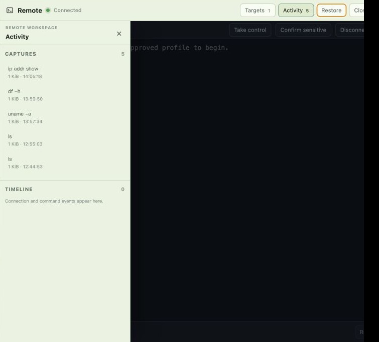

# Pi Web Seeker 功能指南

本文集中介绍 Pi Web Seeker 的主要能力。安装、工作区、构建和 Docker 部署见[用户指南](user-guide.md)。

## 会话、输入与模型

Pi Web Seeker 可以直接浏览 pi 的 `.jsonl` 会话文件。真正发送消息时才创建或复用进程内 `AgentSession`，并通过 SSE 流式返回内容。刷新页面时，正在运行的正式会话可以重新连接事件流。

主要能力包括：

- 会话分叉、会话内分支、历史节点继续和分支导航
- 图片上传与粘贴、提示词片段、输入历史、草稿和运行中引导
- Provider、model、API key、OAuth、thinking level 和工具预设管理
- 模型连通性测试、token/cache/cost/context 统计和手动压缩
- 工作区搜索与代码、Markdown、HTML、图片和音频预览
- English / 简体中文、多主题、聊天 Minimap 和长会话懒渲染

Quick Chat 通过 `pi-ai` 直接调用模型，不创建 `AgentSession` 或加载工具。联网开关、来源和历史只保留在当前浏览器标签；选择“转正式”后才写入标准会话。

## SSH / Telnet 远程分析

Remote 面板为每个正式 AgentSession 保持最多一个活动连接。Agent 工具和人工终端共用连接，目标由用户预先创建；Agent 只能引用 `profileId`，不能自行指定主机或凭据。Quick Chat 不加载 Remote 工具。

### 基本流程

1. 在正式会话打开 Remote 标签，并为当前工作区启用内置 `pi-remote-exec` package。
2. 在 Targets 抽屉创建 SSH 或 Telnet 目标。
3. 提交当前认证方式所需的临时密码或私钥口令。
4. 完成 SSH 主机指纹或 Telnet 明文风险确认。
5. 使用 Run 输入框或 Agent 的 `remote_execute` 执行命令。
6. 在 Activity 抽屉查看命令时间线和捕获，必要时显式导出到工作区后使用 bash 或 Python 分析。

Remote 采用终端优先布局，Targets 和 Activity 是覆盖式抽屉，不会压缩终端列数。Agent 执行时人工输入锁定；需要交互操作时可以 Take control，接管会中止当前 Agent 命令，交还控制后自动执行才会恢复。

### 主机类型与命令策略

目标可以显式配置为 Linux、FreeBSD、Windows、Cisco、通用网络或自定义模式，也可以选择 Auto-detect。

自动检测只运行固定、无插值、短超时和小输出上限的只读探针。检测结果只是提示，用户必须在当前连接选择 Apply detected policy 后才会采用；冲突、异常、无结果和未确认状态都使用 `unknown` 策略。

- Linux、FreeBSD、Windows 和 Cisco 使用各自严格的查询白名单。
- 配置、删除、提权、重启、Shell 操作符、未知参数和无法分类的命令需要审批。
- Cisco 的 running-config、startup-config 和 tech-support 属于敏感读取。
- Run 输入框和 Agent 工具使用同一分类与审批路径。
- `Full-auto` 仅在当前连接跳过命令审批，不跳过指纹、Telnet 风险、凭据保护或捕获导出审批。

人工 Take control 本身视为用户明确授权，不解析交互终端中的每一行命令。

### 凭据与连接安全

- 密码和私钥口令只在连接期间驻留内存，不写入 `remote-targets.json`。
- 请求只发送当前认证方式需要的秘密字段；成功、失败、取消、断开或切换目标后都会清除。
- 终端输出、SSE、错误、时间线和捕获写入前使用流式秘密脱敏。
- Telnet 登录阶段默认不转发认证交互输出，但协议链路本身仍是明文。
- SSH 首次连接显示 SHA-256 主机指纹；已保存指纹变化时硬阻断。
- 旧连接事件和旧请求通过连接 generation 隔离，不能覆盖新会话状态。

### 捕获与导出

命令结果直接返回最多 64 KiB 预览和 `captureId`，完整输出进入 Agent 数据目录的敏感捕获库。捕获支持分页读取和搜索，默认总量上限 256 MiB、保留 30 天并按 LRU 清理。

每次导出都需要审批，包括新建和覆盖。审批前后服务端都会校验 allowed-root、祖先 symlink、目标状态和覆盖状态，并使用临时文件原子替换。

Remote 捕获以及 `remote_session`、`remote_execute`、`remote_capture` 的工具调用和结果不会进入普通会话导出或 Debug Bundle。工作区启用状态 `.pi/` 和默认导出目录 `.pi-remote/` 都被 Git 和 Debug Bundle 排除。



## Plan Mode

在输入框开头键入 `/` 可以使用：

- `/plan`：主 agent 进入产品层只读计划模式，完成探索后输出可渲染为 PlanCard 的计划。
- `/normal`：恢复进入计划模式前的工具和 system prompt。
- `/plan-subagent`：可选增强模式，需要已加载 `pi-subagents` 的 `Agent` 和 `get_subagent_result` 工具。

模式按 session 保存；Agent 运行期间不能切换。Plan Mode 会收窄工具并阻断明显写入类 bash 命令，但它不是操作系统 sandbox。处理不可信项目仍应使用容器或虚拟机。


## Debug Bundle

普通 Markdown / JSON 导出用于阅读和归档；Debug Bundle 用于跨机器复现调试。它以 `.tar.gz` 保存会话、媒体证据、工作区快照和脱敏环境诊断。

导入分为 inspect 和 import：先校验包并展示目标 sandbox、数量、大小和警告，确认后才恢复会话和工作区。恢复后的 cwd 会指向新的 sandbox，不默认写回原始绝对路径。

默认工作区范围为 Git tracked 文件和未忽略的 untracked 文件。以下内容不会进入 bundle：

- `.git`、`.pi`、`.pi-remote`、`node_modules`、`.next` 和构建缓存
- `.env*`、疑似 auth/token/key 文件
- Remote 工具调用、结果与捕获
- 超限大文件和 symlink


## AGENTS.md 助手

新工作区缺少 `AGENTS.md` 时，页面可以基于仓库中可证实的信息生成短草稿；已有文件时可以运行检查或生成对照草稿。草稿只在页面预览，用户确认后才写入。

CLI 可以扫描、生成和检查：

```bash
npm run agents -- detect --dir /path/to/project
npm run agents -- draft --dir /path/to/project
npm run agents:init -- --template auto --dir /path/to/project
npm run agents:check -- --path /path/to/project/AGENTS.md
```

内置模板包括 `auto`、`standard`、`next-app`、`python` 和 `docker-service`。检查器会报告长度、章节、疑似密钥、无效命令、大文件树和过长代码块；`--strict` 可以用于 CI。

## Subagents

Pi Web Seeker 负责渲染 subagent 通知，不负责实现子智能体运行时。使用前需要在 pi 中安装扩展：

```bash
pi install npm:@tintinweb/pi-subagents
```

也可以使用仓库依赖中的 CLI：

```bash
npx --no-install pi install npm:@tintinweb/pi-subagents
```

Docker Compose 环境需要在容器内安装，配置会保存在持久化的 `.pi-web-data/agent/settings.json`。新 AgentSession 启动时才会加载扩展；工具预设 Low 和 High 会保留扩展工具，Off 会关闭全部工具。

完成通知会显示 agent 类型、状态、turns、tool uses、tokens、context、compaction、耗时、结果和 transcript 信息。

## coms-net 与 Pi Pi

内置 `pi-packages/pi-coms-net` 允许不同机器、工作目录或 Pi 进程通过 HTTP/SSE hub 协作；Pi Pi 的 `query_experts` 使用专家模板并行研究 Pi 相关问题。

本机启动：

```bash
npm run coms-net:server
```

默认只监听 `127.0.0.1`。局域网模式必须设置公开地址和认证 token：

```bash
PI_COMS_NET_HOST=0.0.0.0 \
PI_COMS_NET_PORT=52965 \
PI_COMS_NET_PUBLIC_URL=http://192.168.1.10:52965 \
PI_COMS_NET_AUTH_TOKEN=your-long-random-token \
npm run coms-net:server
```

安装内置 package：

```bash
./node_modules/.bin/pi install "$PWD/pi-packages/pi-coms-net"
```

提供的工具包括 `coms_net_list`、`coms_net_send`、`coms_net_get`、`coms_net_await` 和 `query_experts`。

## 运行时系统提示词上下文

新的 AgentSession 会按实际环境追加简短运行时上下文，包括操作系统、shell、cwd、路径约定和包管理器线索，提醒 Agent 使用当前平台兼容的命令并避免输出敏感信息。

如果新会话关闭全部工具，系统仍保持空 system prompt，不强行注入上下文。

## 模型与长上下文

推荐在 Models 面板使用上游内置 provider 并保存密钥。密钥位于智能体数据目录的 `auth.json`，不应写入仓库。

模型详情页 Test 会发起真实轻量请求。CLI needle-in-context 测试示例：

```bash
npm run test:context -- --provider deepseek --model deepseek-v4-pro --tokens 128000
```

脚本支持 `openai-completions` 和 `anthropic-messages`，并根据 start、middle、end needle 命中和 token usage 判断结果。真实上下文长度以 provider 返回的 usage 为准。
